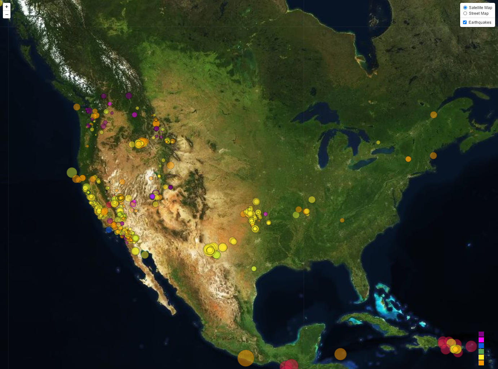
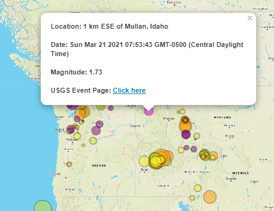
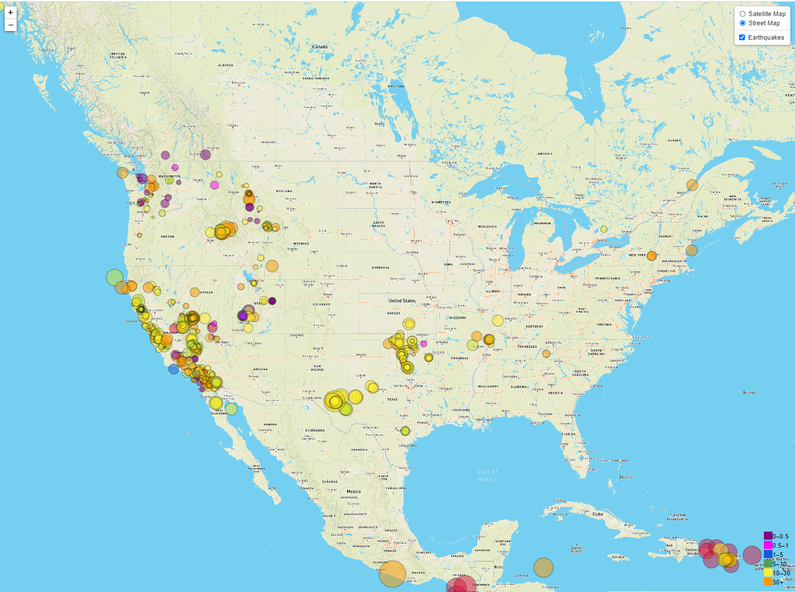

<html>

            
<body>

The project provides a visualization of GeoJSON earthquake data utilizing Leaflet, JavaScript, Mapbox, and HTML.

GeoJSON data was sourced from the USGS.<a href="https://earthquake.usgs.gov/earthquakes/feed/v1.0/summary/all_week.geojson"> Visit USGS data.</a>

Detailed data about the earthquake can be viewed by clicking the circular marker.
<a href="https://danawoodruff.github.io/Leaflet-challenge/">View GitHub-Page.</a> 
The opacity of the bubbles allow the user to identify multiple earthquakes that are overlapped.

The chart initially loads visualizing a street map view with earthquake events but the user has the option to select a satellite view.
The radius of the circular marker indicates its magnitude while the color indicates the depth of the earthquake origin in kilometers.

Users may view code at the following links:

To view the JavaScript code: [JavaScript Code](static/js/logic.js) 
To view the HTML code: [HTML Code](index.html) 
To view the CSS code: [CSS code](static/css/style.css)

 

</body>
</html>
